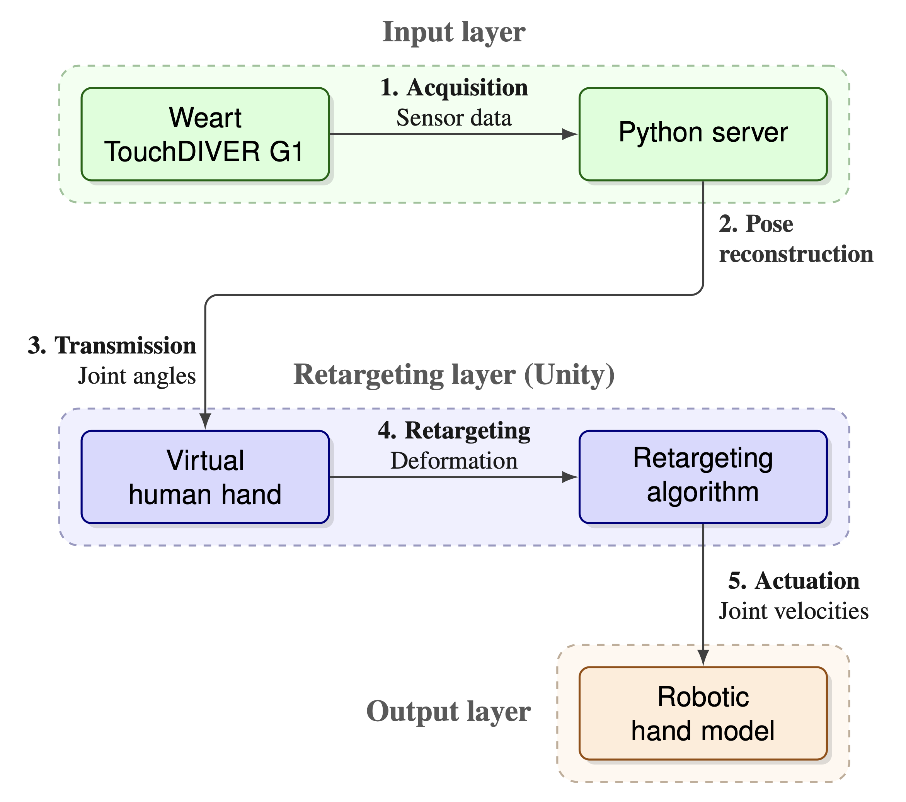
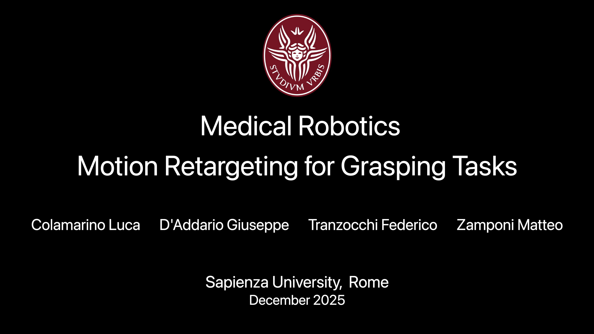

# Motion Retargeting For Grasping Tasks
### Medical Robotics - La Sapienza, Roma, 2025
**Giuseppe D'Addario**, **Federico Tranzocchi**, 
**Luca Colamarino**, **Matteo Zamponi**

---
The aim of the project is to develop a framework for **retargeting** the motion of a human hand on 
**different hand models** for **grasping** tasks using **synergies** (correlation of degrees of freedom in 
patterns of more frequent use). The system pipeline is the following:

---
## Project Video

---
## Dataset 
[1] The human hand data is acquired using a **data glove** (Weart TouchDIVER G1 haptic glove)
Each data sample in the final dataset consists of:
- 45 joint angle values (3 rotational axes ×15 joints)
- 4 input parameters (ThumbClosure, IndexClosure, MiddleClosure, ThumbAbduction)
- 1 timestamp indicating when the sample was recorded.

---
## Hand Models
The hand models used for retargeting are:
- **Barrett Hand** (Barrett Technology)
- **Mia Hand** (Prensilia)
- **Shadow Dexterous Hand** (Shadow Robot Company)

All robotic hand assets were sourced from the [hand_embodiment](https://github.com/dfki-ric/hand_embodiment) repository by DFKI-RIC.

---
## Bibliography
[[1]](docs/Motion_Retargeting_on_a_Human_Hand_Model.pdf) Motion Retargeting on a Human Hand Model. Project by: Charlotte Ludovica Primiceri, Serena Trovalusci, 
Diana Ioana Bubenek Turconi, Giordano Pagano. M.Sc. Students, AIRO, Sapienza University of Rome.

[[2]](docs/ns010105.pdf) Postural Hand Synergies for Tool Use. Marco Santello, Martha Flanders, and John F. Soechting, Neuroscience Department, 
University of Minnesota, Minneapolis, Minnesota 55455.

[[3]](docs/Mapping_Synergies_From_Human_to_Robotic_Hands_With_Dissimilar_Kinematics_An_Approach_in_the_Object_Domain_2.pdf) Mapping Synergies From Human to Robotic Hands With Dissimilar Kinematics: 
An Approach in the Object Domain. Guido Gioioso, Gionata Salvietti, Monica Malvezzi and Domenico Prattichizzo.
